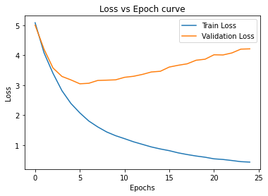

# RNN Hands-On 4

This assignment's objectives are to train English to German Seq2Seq machine translation model using attention and techniques such as packed padded sequences and masking. This helps in the performance of the model as well as improving training time. Following model variants are covered-

1. Neural Machine Translation by Jointly Learning to Align and Translate 

2. Attention based Seq2Seq machine translation with packed padded sequences and masking. 

## Architecture changes and technique addition

#### Model 1: Neural Machine Translation by Jointly Learning to Align and Translate

Attention vector is calculated from previous hidden state of the decoder, st−1 , and all of the stacked forward and backward hidden states from the encoder. Attention vector calculates how well each encoder hidden state matches the previous decoder hidden state. Attention vector provides guidance to the decoder to pay the attention to particular words in source sentence in order to correctly predict the next word to decode. Attention is as follows-

a) Calculate the energy between the previous decoder hidden state and the encoder hidden states. It tells how well each encoder hidden state "matches" the previous decoder hidden state.

b) Calculate weights for a weighted sum of the energy across all encoder hidden states. These weights tells how much attention needs to be given to each token in the source sequence.

c) To ensure attention vector fits the constraints of having all elements between 0 and 1 and the vector summing to 1 by passing it through a softmax layer.

#### Model 2: Attention model with packed padded sequences and masking

Packed padded sequences are used to tell RNN to skip over padding tokens in encoder. Masking explicitly forces the model to ignore certain values, such as attention over padded elements. This helps in model performance as well as reduce training time.

## Results

#### Train/Validation loss vs epoch
| Model 1  | Model 2  |
|---|---|
|   |   |

#### Test Loss and training time

BLEU looks at the overlap in the predicted and actual target sequences in terms of their n-grams. Higher the Bleu score better is the translation.

| Model   | Loss on test dataset  | Training time | Bleu Score on test set |
|---------|------------|---------------|------------|
| Model 1  |  3.044    |    97 seconds |   27.15  |
| Model 2  |  3.085    |    56 seconds |  27.18  |

#### Source sentence to attention mapping

The lighter the square at the intersection between two words, the more attention the model gave to that source word when translating that target word.

| Model 1  | Model 2  |
|---|---|
|   |   |
