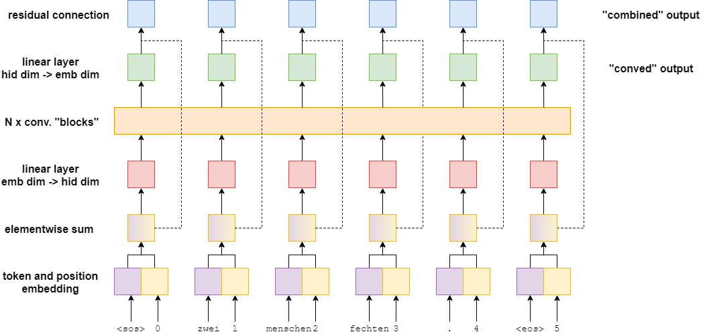
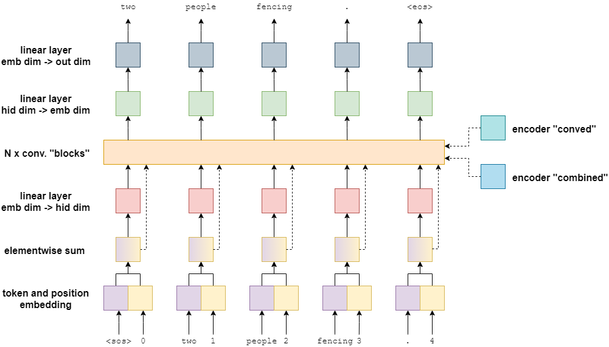
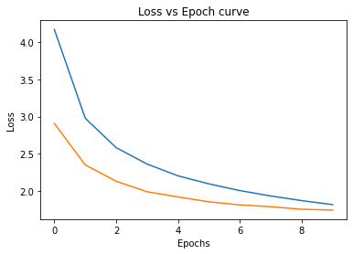
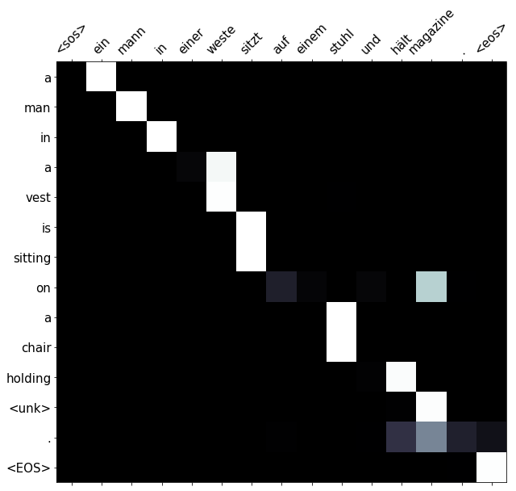

# Convolutional Sequence to Sequence learning

This assignment's objective is to build convolution based Sequence to Sequence machine translation model to translate sentences from German to English.

## Architecture

### Encoder

Encoder's role is to encode the input sentence which is in the source language into a context vector.
Encoder produces two context vectors per token. So if the input German sentence has 4 tokens, it would produce 8 context vectors. The two context vectors produced by the encoder are 'conved vector' and 'combined vector'. Conved vector is produced by passing each token through a few fully connected layers and the convolutional block. Combined vector is the sum of the convolved vector and the embedding of the token.

### Decoder

Decoder's role is to use the context vector to produce the output sentence in the target language. Decoder model, unlike recurrent models, predicts all the tokens in parallel in the target sentence.

## Results

### Train/Validation loss vs epoch

### Test Loss and Bleu score

| Test Loss | Bleu Score |
|-----------|------------|
|  1.792    |   34.89    |

### Source sentence to attention mapping

X-axis : source sentence

Y-axis : predicted translation

Source sentence = 'ein', 'mann', 'in', 'einer', 'weste', 'sitzt', 'auf', 'einem', 'stuhl', 'und', 'hält', 'magazine', '.'

Target sentence = 'a', 'man', 'in', 'a', 'vest', 'is', 'sitting', 'in', 'a', 'chair', 'and', 'holding', 'magazines', '.'

Predicted sentence = 'a', 'man', 'in', 'a', 'vest', 'is', 'sitting', 'on', 'a', 'chair', 'holding', '<unk>', '.', '<EOS>'

The lighter the square at the intersection between two words, the more attention the model gave to that source word when translating that target word.

