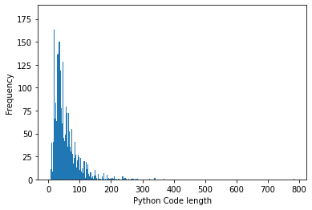
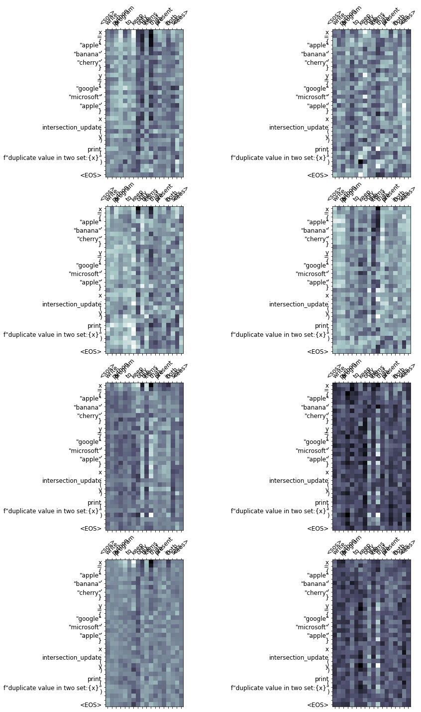
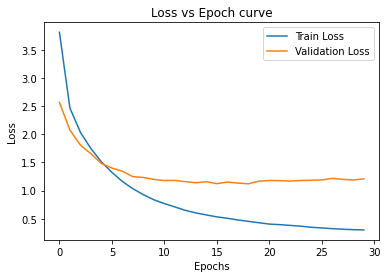

# Capstone Project

The objective of this project is to prepare a transformer-based model (with self-attention, multi-head, and scaled-dot product attention) to write python code from English based statements.


## Data Preprocessing

### 1. Dataset division into English statements and Python codes

The dataset contains English statements and corresponding Python code for it. The English statements were corrected as much as possible to include 'Python function' in English statement for Python function code and 'Python program' for Python statements so as to enable the model to learn the code directions.

Comments with keywords 'write', 'python', 'program', 'function', 'class' were picked as English statements and the following code as its Python code. Code for dataset division is present in the notebook.

### 2. Anomalies in the datset

Missing/incorrect indentations for the Python codes were checked using [check_indentation.py](check_indentation.py) script and corrected. English statements were corrected to include keywords and provide clear instructions for the Python code. autopep8 and tokenize packages were used to check the syntax of the Python code.

### 3. Maximum length of Python code for model

Length of each tokenized Python code was calculated to understand the frequency. From this, tokenized code length of 400 was considered for the model and examples beyond the cutoff was discarded.



### 4. Tokenization for Python code

tokenize package has been used for tokenizing python code. This is specially useful in cases with math operators, function name and its arguments. Tokenize is able to better generalize on math operators. Tokenizing on "range(2, num//2 + 1)" returns 'range',  '(',  '2',  ',',  'num',  '//',  '2',  '+',  '1',  ')', while with spacy-english tokenizer it returns 'range(2',  ',',  'num//2',  '+',  '1',  ')'.

Python code
```
for i in range(2, num//2 + 1):
        if (num % i) == 0:
```


Using spacy-english tokenizer
 ```
 'for',  'i',  'in',  'range(2',  ',',  'num//2',  '+',  '1',  ')',  ':',  '\n        ',
 'if',  '(',  'num',  '%',  'i',  ')',  '=',  '=',  '0',  ':',
 '\n 
 ```

Using tokenize package

```
'for',  'i',  'in',  'range',  '(',  '2',  ',',  'num',  '//',  '2',  '+',  '1',  ')',  ':',  '\n',
 '        ',  'if',  '(',  'num',  '%',  'i',  ')',  '==',  '0',  ':',
 '\n',
 ```
 


## Model Architecture

The model is based on self-attention, multi-head, and scaled-dot product attention. Self-attention is the method by which the transformer deciphers “understanding” of other relevant words into the currently processed word.


### Model hyperparameters

* Encoder/Decoder hidden layer dimension= 512
* Encoder layers= 3
* Encoder Head= 8
* Encoder PF dimension= 1024
* Decoder layers= 3
* Decoder Head= 8
* Decoder PF dimension= 1024

The following iterations were carried out to conclude the best fit model hyperparameters. 

|        |         | Encoder |      |        | Decoder |      |        |                  |            |          |           |
|--------|---------|---------|------|--------|---------|------|--------|------------------|------------|----------|-----------|
|        | Hid Dim | Layers  | Head | PF_dim | Layers  | Head | PF_dim | No of parameters | Train Loss | Val Loss | Test Loss |
| Test 1 | 256     | 3       | 8    | 512    | 3       | 8    | 512    | 6,087,806        | 0.455      | 1.193    | 1.087     |
| Test 2 | 512     | 3       | 8    | 1024   | 3       | 8    | 1024   | 20,036,734       | 0.275      | 1.129    | 1.059     |
| Test 3 | 256     | 6       | 8    | 512    | 6       | 8    | 512    | 10,041,470       | 4.321      | 4.507    | 4.509     |
| Test 4 | 512     | 6       | 8    | 1024   | 6       | 8    | 1024   | 35,808,382       | 4.47       | 7.612    | 4.512     |


## Results

### Attention for Actual-Generated Python Code

Shared below, is the source code to attention mapping

X-axis : English statement

Y-axis : predicted Python code

The lighter the square at the intersection between two words, the more attention the model gave to that source word when translating that target word.

English statement: write a python program to   keep only the items that are present in both sets

Actual Python code (additonal space between words and at the start of newline is during list :

```
x = { "apple" , "banana" , "cherry" } 
 y = { "google" , "microsoft" , "apple" } 
 x . intersection_update ( y ) 
 print ( f"duplicate value in two set:{x}" )
```

Predicted Python code:

```
x = { "apple" , "banana" , "cherry" } 
 y = { "google" , "microsoft" , "apple" } 
 x . intersection_update ( y ) 
 print ( f"duplicate value in two set:{x}" ) 
```




### Train/Validation Loss curve



### Generated Python code examples

```
with a given integral number n , write a program to generate a dictionary that contains ( i , i*i*i ) such that is an integral number between 1 and n ( both included ) . and then the program should print the dictionary .
--------Actual-----------
n = 8 
 d = dict ( ) 
 for i in range ( 1 , n + 1 ) : 
 	 d [ i ] = i * i * i 
  print ( d )  
--------Predicted-----------
n = int ( input ( <unk> ) ) 
 d = dict ( ) 
 for i in range ( 1 , n + 1 ) : 
 	 d [ i ] = i * i 
  print ( d ) 


write a python program to join two sets
--------Actual-----------
set1 = { "a" , "b" , "c" } 
 set2 = { 1 , 2 , 3 } 
 set3 = set2 . union ( set1 ) 
 print ( f"joined set:{set3}" )  
--------Predicted-----------
set1 = { "a" , "b" , "c" } 
 set2 = { 1 , 2 , 3 } 
 set3 = set2 . union ( set1 ) 
 print ( f"joined set:{set3}" ) 


write a python function to return random selection from itertools.product(*args , * * kwds )
--------Actual-----------
def random_product ( * args , repeat = 1 ) : 
 	 import random 
 pools = [ tuple ( pool ) for pool in args ] * repeat 
 return tuple ( map ( random . choice , pools ) )   
--------Predicted-----------
def random_product ( * args , repeat = 1 ) : 
 	 import random 
 pools = [ tuple ( pool ) for pool in args ] * repeat 
 return tuple ( map ( random . choice , pools ) )  


write a python program which takes user input tuple and prints length of each tuple element
--------Actual-----------
userinput = input ( "enter a tuple:" ) 
 x = map ( lambda x : len ( x ) , tuple ( x . strip ( ) for x in userinput . split ( ',' ) ) ) 
 print ( list ( x ) )  
--------Predicted-----------
userinput = input ( "enter a tuple:" ) 
 x = map ( lambda x : len ( x ) , tuple ( x . strip ( ) for x in userinput . split ( ',' ) ) ) 
 print ( list ( x ) ) 


write a python program to print all prime numbers in a given interval
--------Actual-----------
lower = 900 
 upper = 1000 
 for num in range ( lower , upper + 1 ) : 
 	 if num > 1 : 
 		 for i in range ( 2 , num ) : 
 			 if ( num % i ) == 0 : 
 				 break 
   else : 
 			 print ( num )     
--------Predicted-----------
lower = 900 
 upper = 1000 
 for num in range ( lower , upper + 1 ) : 
 	 if num > 1 : 
 		 for i in range ( 2 , num ) : 
 			 if ( num % i ) == 0 : 
 				 break 
   else : 
 			 print ( num )     


write a python program to convert dictionary to json
--------Actual-----------
import json 
 person_dict = { 'name' : 'bob' , 
 'age' : 12 , 
 'children' : none 
 } 
 person_json = json . dumps ( person_dict ) 
 print ( person_json )  
--------Predicted-----------
import json 
 person_dict = { 'name' : 'bob' , 
 'age' : 12 , 
 'children' : none 
 } 
 person_json = json . dumps ( person_dict ) 
 print ( person_json ) 
 


write a python program to convert decimal number to octal
--------Actual-----------
print ( '%o,' % ( 8 ) )  
--------Predicted-----------
dec = 344 
 print ( "the decimal value of" , dec , "is:" ) 
 print ( oct ( dec ) , "in octal." ) 
 print ( hex ( dec ) , "in hexadecimal." ) 


write a python program to count the number of each vowels
--------Actual-----------
vowels = 'aeiou' 
 ip_str = 'hello, have you tried our tutorial section yet?' 
 ip_str = ip_str . casefold ( ) 
 count = { } . fromkeys ( vowels , 0 ) 
 for char in ip_str : 
 	 if char in count : 
 		 count [ char ] += 1 
   print ( count )  
--------Predicted-----------
vowels = 'aeiou' 
 ip_str = <unk> 
 ip_str = ip_str . casefold ( ) 
 count = { } . fromkeys ( vowels , 0 ) 
 for char in ip_str : 
 	 if char in count : 
 		 count [ char ] += 1 
   print ( count ) 


write a python function to return woodall numbers
--------Actual-----------
def woodall_number ( n ) : 
 	 if n >= 0 : 
 		 return n * 2 ** n - 1 
 
   
--------Predicted-----------
def <unk> ( n ) : 
 	 if n >= 0 : 
 		 return n * 2 ** n - 1 


python program to check whether a string is palindrome or not
--------Actual-----------
my_str = 'aibohphobia' 
 my_str = my_str . casefold ( ) 
 rev_str = reversed ( my_str ) 
 if list ( my_str ) == list ( rev_str ) : 
 	 print ( "the string is a palindrome." ) 
  else : 
 	 print ( "the string is not a palindrome." )   
--------Predicted-----------
my_str = 'aibohphobia' 
 my_str = my_str . casefold ( ) 
 rev_str = reversed ( my_str ) 
 if list ( my_str ) == list ( rev_str ) : 
 	 print ( "the string is a palindrome." ) 
  else : 
 	 print ( "the string is a palindrome." )   


Q1111:  write a function to return the cartisian distance between two points
--------Actual-----------
def cal_cart_distance ( x1 : float , y1 : float , x2 : float , y2 : float ) -> float : 
 	 return ( ( x1 - x2 ) ** 2 + ( y1 - y2 ) ** 2 ) ** ( 1 / 2 )   
--------Predicted-----------
def cal_cart_distance ( x1 : float , y1 : float , x2 : float , y2 : float ) -> float : 
 	 return ( x1 - x2 ) ** 2 + ( y1 - y2 ) ** ( 1 / 2 ) ** 2 )


write a python function to append all elements of one list to another
--------Actual-----------
def extend_list ( list1 , list2 ) : 
 	 list1 = [ 1 , 2 ] 
 list2 = [ 3 , 4 ] 
 return list1 . extend ( list2 )   
--------Predicted-----------
def extend_list ( list1 , list2 ) : 
 	 list1 = [ 1 , 2 ] 
 list2 = [ 3 , 4 ] 
 return list1 . extend ( list2 )  


write a python program to print the largest number among the three input numbers
--------Actual-----------
num1 = float ( input ( "enter first number: " ) ) 
 num2 = float ( input ( "enter second number: " ) ) 
 num3 = float ( input ( "enter third number: " ) ) 
 
 if ( num1 >= num2 ) and ( num1 >= num3 ) : 
 	 largest = num1 
  elif ( num2 >= num1 ) and ( num2 >= num3 ) : 
 	 largest = num2 
  else : 
 	 largest = num3 
  print ( "the largest number is" , largest )  
--------Predicted-----------
num1 = float ( input ( "enter first number: " ) ) 
 num2 = float ( input ( "enter second number: " ) ) 
 num3 = float ( input ( <unk> ) ) 
 if ( num1 >= num3 ) and ( num1 >= num3 ) : 
 	 largest = num1 
  elif ( num2 >= num1 ) and ( num2 >= num1 >= num1 ) : 
 	 largest = num2 
  else : 
 	 largest = num2 
   print ( f'largest:{largest}' ) 


write a python program to generate a random date between given start and end dates
--------Actual-----------
import random 
 import time 
 
 def getrandomdate ( startdate , enddate ) : 
 	 print ( "printing random date between" , startdate , " and " , enddate ) 
 randomgenerator = random . random ( ) 
 dateformat = '%m/%d/%y' 
 
 starttime = time . mktime ( time . strptime ( startdate , dateformat ) ) 
 endtime = time . mktime ( time . strptime ( enddate , dateformat ) ) 
 
 randomtime = starttime + randomgenerator * ( endtime - starttime ) 
 randomdate = time . strftime ( dateformat , time . localtime ( randomtime ) ) 
 return randomdate 
 
  print ( "random date = " , getrandomdate ( "1/1/2016" , "12/12/2018" ) )  
--------Predicted-----------
import random 
 def getrandomdate ( startdate , enddate ) : 
 	 print ( "printing random date between" , startdate , " and " , enddate ) 
 randomgenerator = random . random ( ) 
 dateformat = '%m/%d/%y' 
 
 starttime = time . mktime ( time . strptime ( startdate , dateformat ) ) 
 endtime = time . mktime ( time . strptime ( enddate , dateformat ) ) 
 
 randomtime = starttime + randomgenerator * ( endtime - starttime ) 
 randomdate = time . strftime ( dateformat , time . localtime ( randomtime ) ) 
 return randomdate 
  print ( "random date = " , getrandomdate ( "1/1/2016" , "12/12/2018" ) ) 
 


python program to illustrate different set operations
--------Actual-----------
e = { 0 , 2 , 4 , 6 , 8 } 
 n = { 1 , 2 , 3 , 4 , 5 } 
 print ( "union of e and n is" , e | n ) 
 print ( "intersection of e and n is" , e & n ) 
 print ( "difference of e and n is" , e - n ) 
 print ( "symmetric difference of e and n is" , e ^ n )  
--------Predicted-----------
e = { 0 , 2 , 4 , 6 , 8 } 
 n = { 1 , 2 , 3 , 4 , 5 } 
 print ( "union of e and n is" , e | n ) 
 print ( "intersection of e and n is" , e - n ) 
 print ( <unk> , e - n ) 
 print ( <unk> , e - n ) 
 print ( <unk> , e - n ) 
 print ( <unk> , e - n - 2 ) 


write a python program to print all prime numbers in a given interval
--------Actual-----------
lower = 900 
 upper = 1000 
 for num in range ( lower , upper + 1 ) : 
 	 if num > 1 : 
 		 for i in range ( 2 , num ) : 
 			 if ( num % i ) == 0 : 
 				 break 
   else : 
 			 print ( num )     
--------Predicted-----------
lower = 900 
 upper = 1000 
 for num in range ( lower , upper + 1 ) : 
 	 if num > 1 : 
 		 for i in range ( 2 , num ) : 
 			 if ( num % i ) == 0 : 
 				 break 
   else : 
 			 print ( num ) 


write a python program to print words lengths in string
--------Actual-----------
test_string = "india is my country" 
 res = list ( map ( len , test_string . split ( ) ) ) 
 print ( "the list of words lengths is : " + str ( res ) )  
--------Predicted-----------
test_string = "india is my country" 
 res = list ( map ( len , test_string . split ( ) ) ) 
 print ( <unk> + str ( res ) ) 


python program to multiply all the numbers in given list
--------Actual-----------
def multiply ( numbers ) : 
 	 total = 1 
 for x in numbers : 
 		 total *= x 
  return total 
  print ( multiply ( ( 8 , 2 , 3 , - 1 , 7 ) ) )  
--------Predicted-----------
def multiply ( numbers ) : 
 	 total = 1 
 for x in numbers : 
 		 total *= x 
  return total 
  print ( multiply ( ( 8 , 2 , 3 , 7 ) ) 


Q1140:  write a python program to print the difference in days between two dates
--------Actual-----------
from datetime import date 
 date1 = date ( 2020 , 10 , 25 ) 
 date2 = date ( 2020 , 12 , 25 ) 
 print ( f'difference between dates: {(date2 - date1).days}' )  
--------Predicted-----------
from datetime import date 
 def <unk> ( date1 , date2 ) : 
 	 diff = date1 - date2 
 return diff . days  


write a python function that prints the contents of a file in reverse order
--------Actual-----------

 def reverse_content ( filename ) : 
 	 for line in reversed ( list ( open ( filename ) ) ) : 
 		 print ( line . rstrip ( ) )    
--------Predicted-----------
def reverse_content ( filename ) : 
 	 for line in reversed ( list ( open ( filename ) ) ) : 
 		 print ( line . rstrip ( )   


 write a python program to print positive numbers in a list
--------Actual-----------
list1 = [ 11 , - 21 , 0 , 45 , 66 , - 93 ] 
 for num in list1 : 
 	 if num >= 0 : 
 		 print ( num , end = " " )    
--------Predicted-----------
list1 = [ 11 , - 21 , 0 , 45 , 66 , - 93 ] 
 for num in list1 : 
 	 if num >= 0 : 
 		 print ( num , end = " " ) 


write a python class that will initiate a number , input a number and print the number
--------Actual-----------
class number : 
 	 def __init__ ( self , num ) : 
 		 self . num = num 
 
  def inputnum ( self ) : 
 		 self . num = int ( input ( "enter an integer number: " ) ) 
 
  def printnum ( self ) : 
 		 print ( self . num )    
--------Predicted-----------
class number : 
 	 def __init__ ( self , num ) : 
 		 self . num = num 
  def inputnum ( self ) : 
 		 self . num = int ( input ( "enter an integer number: " ) ) 
 
  def printnum ( self ) : 
 		 print ( self . num )     


python program to check if a number is positive , negative or 0
--------Actual-----------
num = float ( input ( "enter a number: " ) ) 
 if num > 0 : 
 	 print ( "positive number" ) 
  elif num == 0 : 
 	 print ( "zero" ) 
  else : 
 	 print ( "negative number" ) 
  
--------Predicted-----------
num = float ( input ( <unk> ) ) 
 if num > 0 : 
 	 print ( "positive number" ) 
  elif num == 0 : 
 	 print ( "zero" ) 
  else : 
 	 print ( "negative number" ) 


write a python function that accepts a dictionary that has unique values and returns its inversion
--------Actual-----------
def invert_dict ( input_dict ) : 
 	 my_inverted_dict = { value : key for key , value in input_dict . items ( ) } 
 return my_inverted_dict   
--------Predicted-----------
def invert_dict ( dictionary ) : 
 	 inverted_dict = { value : key for key , value in dictionary . items ( ) } 
 return inverted_dict  


write a python function to compute the lcm of two numbers
--------Actual-----------
def lcm ( x , y ) : 
 	 if x > y : 
 		 greater = x 
  else : 
 		 greater = y 
  while ( true ) : 
 		 if ( ( greater % x == 0 ) and ( greater % y == 0 ) ) : 
 			 lcm = greater 
 break 
  greater += 1 
  return lcm 
  
--------Predicted-----------
def compute_lcm ( x , y ) : 
 	 if x > y : 
 		 greater = x 
  else : 
 		 greater = y 
  while ( true ) : 
 		 if ( ( ( greater % x == 0 ) and ( greater % y == 0 ) ) ) : 
 			 lcm = greater 
 break 
  greater += 1 
  greater += 1 
  return lcm 
  
 num1 = 54 
 num2 = 24 
 print ( "the l.c.m. is" , compute_lcm ( num1 , num2 ) ) 
```


